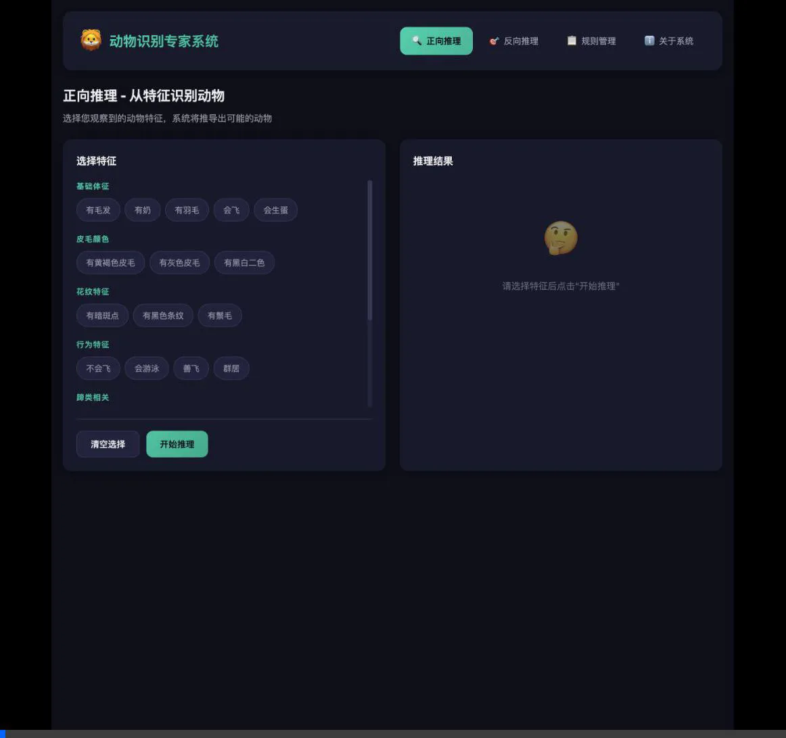
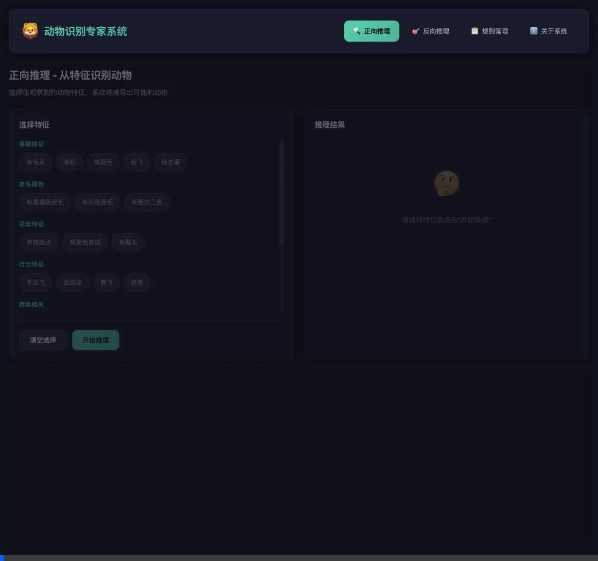
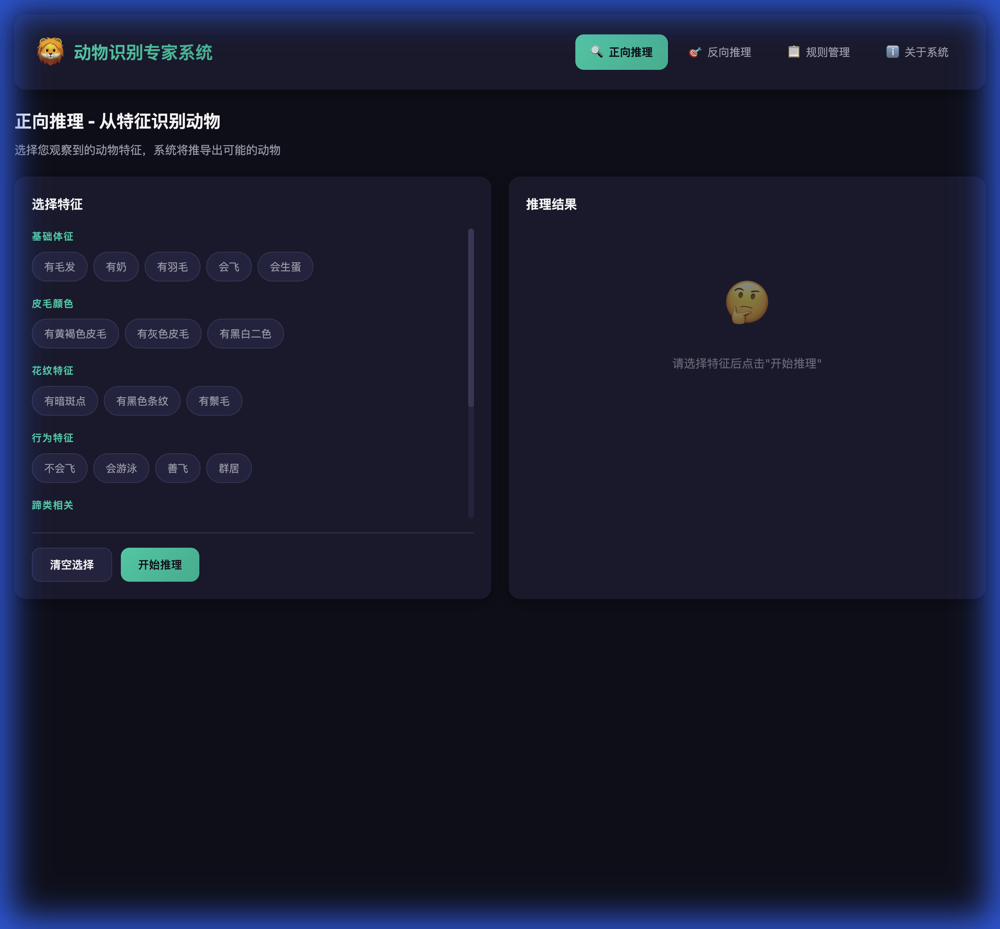
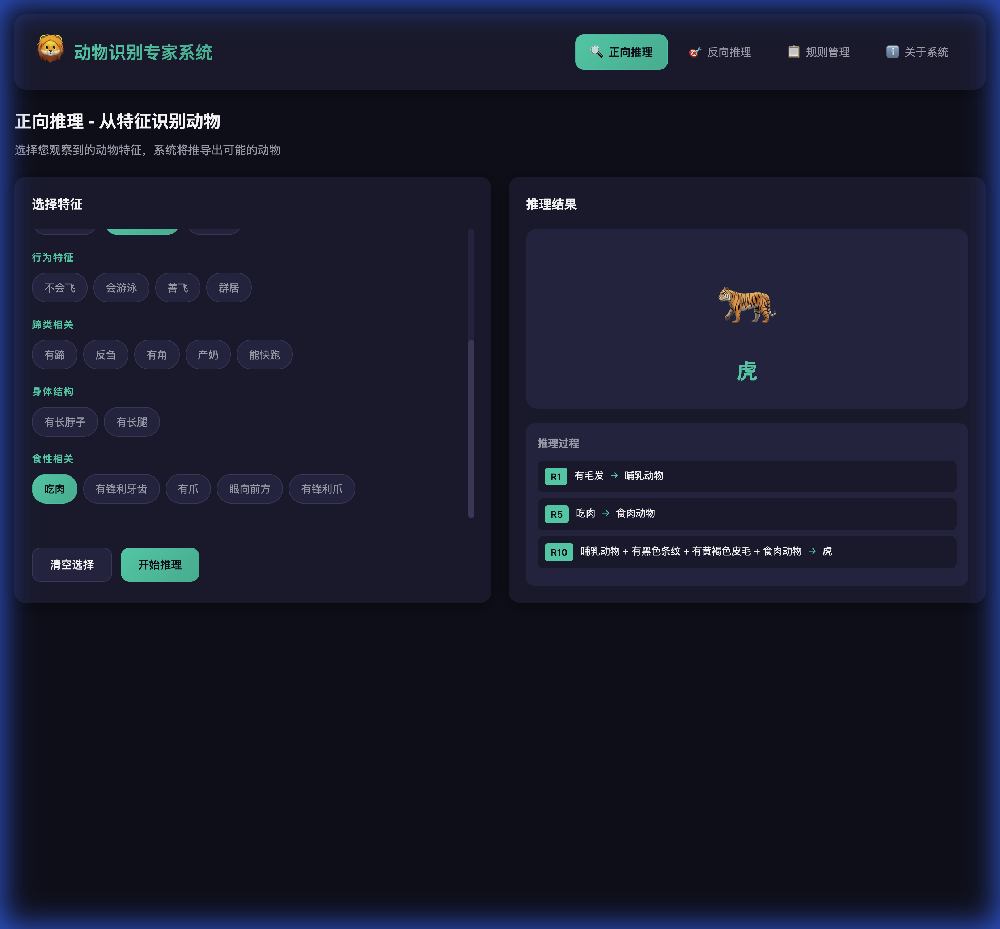

# 动物识别专家系统 - 运行指南


---

## 快速开始

### 1. 安装依赖

```bash
pip install -r requirements.txt
```

### 2. 启动系统

```bash
python3 app.py
```

启动成功后，你会看到：

```
🦁 动物识别专家系统启动中...
📍 访问地址: http://127.0.0.1:5000
```

### 3. 访问系统

在浏览器中打开：**http://127.0.0.1:5000**

---

## 功能使用说明

### 正向推理（Forward Reasoning）

1. 点击导航栏的"正向推理"
2. 勾选动物的特征（如：有毛发、吃肉、有黄褐色皮毛、有黑色条纹）
3. 点击"开始推理"按钮
4. 系统会显示：
   - 识别结果（如："虎"）
   - 详细推理路径（触发了哪些规则）
   - 所有推导出的事实

### 反向推理（Backward Reasoning）

1. 点击导航栏的"反向推理"
2. 选择目标动物（如："企鹅"）
3. 点击"开始验证"
4. 系统会逐个询问条件：
   - 点击"是"：确认该条件
   - 点击"否"：否认该条件（验证失败）
   - 点击"不确定"：系统会尝试进一步推导
5. 所有条件满足后，显示验证成功

### 规则管理

1. 点击导航栏的"规则管理"
2. 查看所有 20 条规则
3. 点击"添加规则"可以创建新规则
4. 每条规则可以编辑或删除

---

## 系统特性

- **12 种可识别动物**：虎、豹、狮子、狼、斑马、长颈鹿、牛、马、企鹅、鸵鸟、信天翁、老鹰
- **20 条产生式规则**：基于教材 P19 例2.7
- **27 种特征**：涵盖体征、食性、皮毛、行为等
- **可视化推理**：展示完整推理路径
- **规则可管理**：支持增删改操作

---

## 测试示例

### 示例 1：识别"虎"

**输入特征**：
- ✓ 有毛发
- ✓ 吃肉
- ✓ 有黄褐色皮毛
- ✓ 有黑色条纹

**推理过程**：
1. R1: 有毛发 → 哺乳动物
2. R5: 吃肉 → 食肉动物
3. R10: 哺乳动物 + 食肉动物 + 有黄褐色皮毛 + 有黑色条纹 → **虎** ✅

### 示例 2：识别"企鹅"

**输入特征**：
- ✓ 有羽毛
- ✓ 不会飞
- ✓ 会游泳
- ✓ 有黑白二色

**推理过程**：
1. R3: 有羽毛 → 鸟
2. R18: 鸟 + 不会飞 + 会游泳 + 有黑白二色 → **企鹅** ✅

---

## 📽️ 系统演示

### 正向推理演示



*从选择特征到识别出"虎"的完整推理过程*

### 反向推理演示



*从选择目标动物"企鹅"到验证成功的完整流程*

---

## 📸 系统截图

| 功能 | 截图 |
|------|------|
| 首页 |  |
| 正向推理结果 |  |
| 反向推理成功 |  |
| 规则管理 |  |

---

## 技术文档

详细设计说明请参阅：[设计说明文档.md](设计说明文档.md)

---

## 常见问题

**Q: 为什么选择了特征但无法识别？**  
A: 可能特征不足。系统需要足够的特征才能推导出结论。可以参考"示例"部分的特征组合。

**Q: 反向推理时如何回答"不确定"？**  
A: 当条件是中间结论（如"哺乳动物"）时，选择"不确定"，系统会进一步询问基础特征来推导。

**Q: 可以添加新动物吗？**  
A: 可以！点击"规则管理" → "添加规则"，定义新的识别规则即可。

---

## 项目结构

```
/专家系统/
├── app.py                 # Flask 后端
├── rules.json             # 规则库
├── requirements.txt       # 依赖列表
├── static/
│   ├── css/style.css      # 样式
│   └── js/main.js         # 前端逻辑
├── templates/
│   └── index.html         # 主页面
├── screenshots/           # 系统截图
├── 设计说明文档.md        # 设计文档
└── README.md              # 本文件
```

---

## License

MIT License
